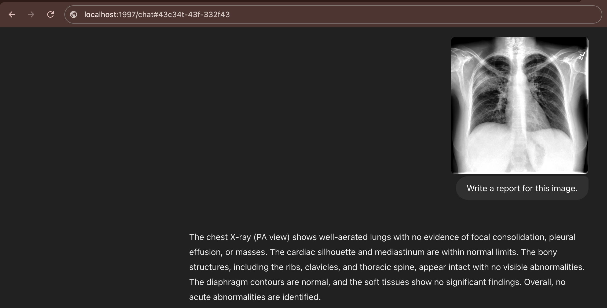

# 🚀 LLaVA CXRay Model Research Project  
### Multimodal Large Language Model Fine-Tuned for Chest X-ray Images  

LLaVA CXRay is a **multimodal large language model** designed to generate radiology reports from chest X-ray images.  

---

## Features  
- **Effortless radiology report generation**  
- **Fine-tuned for accuracy** using chest X-ray datasets  
- Designed for **research and testing purposes only**  

---

## Quick Start  
You can test your chest X-rays with just these few lines of code:  
*(Ensure you have an NVIDIA GPU with VRAM > 16GB)*  

```python
from transformers import AutoModel
from PIL import Image

# Load the model
model = AutoModel.from_pretrained("ECOFRI/CXR-LLAVA-v2", trust_remote_code=True)
model = model.to("cuda")

# Load a chest X-ray image and generate a report
cxr_image = Image.open("img.jpg")
response = model.write_radiologic_report(cxr_image)
```
## 🌟 Demo  
Here's how it looks in action:  

> 📝 **Example Output:**  
> The radiologic report reveals a large consolidation in the right upper lobe of the lungs.  
> There is no evidence of pleural effusion or pneumothorax. The cardiac and mediastinal contours are normal.  

## ⚠️ Note & Disclaimer  
🚧 **This repository is under active research.**  
Please use this code **only for research and testing purposes.**  
